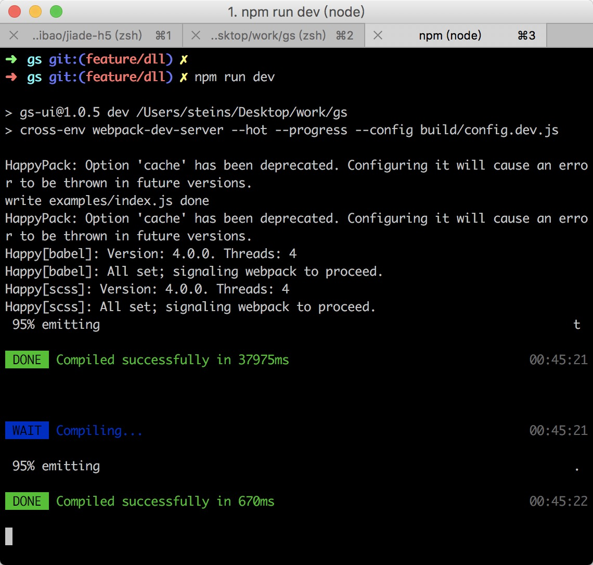
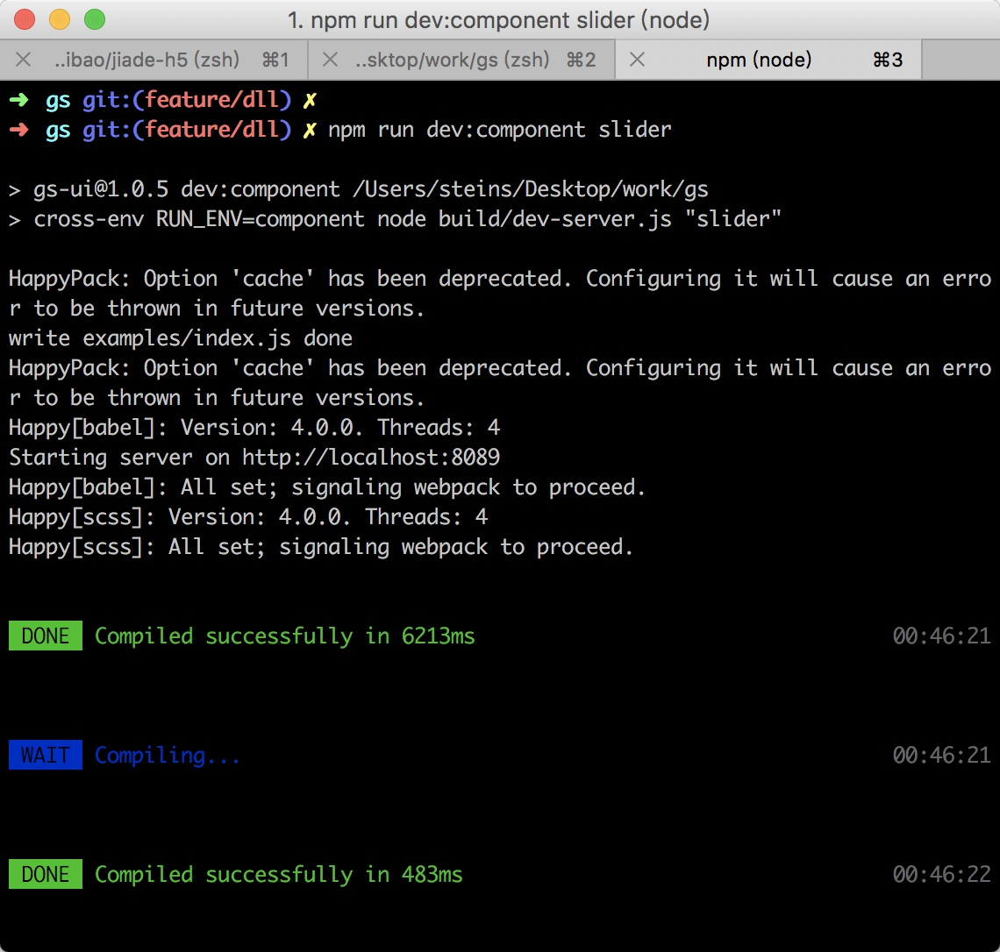
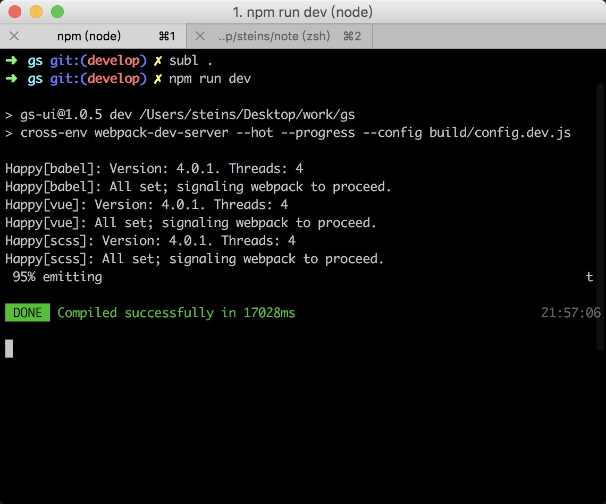

## 组件库的webpack构建速度优化

#### 背景

在公司的主要工作是组件库（基于vue的ui组件库，类似element-ui）的开发，也已经有两个多月，期间一直觉得项目的开发构建太慢，每次开发打开开发环境需要 ***40s*** 左右，简直不能忍。前前后后尝试了各种优化手段，但是都不理想。终于在今天，找到了问题所在，构建速度提升了 ***50%*** 以上，现在只需要 ***19s*** 左右，整个心情都好了。现在记录一下所用到的各种优化手段。

#### 各种配置项的优化

主要是对一些loader添加 `include` `exclude`之类的小优化，其实这一点并没有带来多少性能的提升，只是一些安慰作用吧。

#### 引入happypack

之前有看到相关文章介绍 `happypack` 采用多线程处理，能大大提升项目的构建速度。嗯，我觉得这个靠谱。看了下github上的[文档](https://github.com/amireh/happypack)，赶紧试试水。

> 修改webpack一些loader配置，使用happypack

```js
// config.dev.js
{
  // ...
  module: {
    rules: [{
      test: /\.vue$/,
      use: 'happypack/loader?id=vue',
      exclude: /node_modules/,
      // components目录是组件，examples目录主要是markdown文档，test目录是单元测试
      include: [utils.resolve('./components'), utils.resolve('./examples'), utils.resolve('./test')]
    }, {
      test: /\.js$/,
      use: 'happypack/loader?id=babel'
    }, {
      test: /\.scss$/,
      use: 'happypack/loader?id=scss'
    }]
  },
  plugins: [
    new HappyPack({
      id: 'babel',
      threads: 4,
      loaders: ['babel-loader']
    }),
    new HappyPack({
      id: 'scss',
      threads: 4,
      loaders: [
        'style-loader',
        'css-loader',
        {
          loader: 'postcss-loader',
          options: {
            config: {
              path: utils.resolve('./postcss.config.js')
            }
          }
        },
        'sass-loader'
      ]
    })
  ]
  // ...
}
```

这里主要将组件库中各种需要处理的文件都采用happypack处理，除了上面的 `js` `scss` `vue` 之外，也把 `md` （[vue-markdown-loader](https://github.com/QingWei-Li/vue-markdown-loader)）等进行处理，配置都差不多，就不列出来了。

ok，配置完毕，赶紧跑起来试试水。结果就是报错了... oh no! 看了下[官方文档](https://github.com/amireh/happypack/wiki/Loader-Compatibility-List)说明，不支持 `vue-loader` `vue-markdown-loader`。好吧，把 `vue` 文件和 `md` 文件的处理改回去，再跑。嗯这次跑起来了，但是时间也就少了 `2s` 左右（其实我觉得是一些小波动，根本没少好吧），还那么多... ???(黑人问号脸)

主要是项目中js代码还是比较少的，将运行的命令加上--progress能发现，主要耗时的就是处理md文件，很明显一遇到 `md` 文件进度条的跳动就慢下来了。

知道了，优化的主要目标应该是md文件的处理。

找到了 `build/util.js` 里面对 `vue-markdown-loader` 的一些处理结果的再处理，部分代码如下

```js
function render(tokens, idx) {
  var m = tokens[idx].info.trim().match(/^demo\s*(.*)$/);
  if (tokens[idx].nesting === 1) {
    let index = idx + 1;
    var html = '';
    var style = '';
    var script = '';
    while (tokens[index].nesting === 0) {
      const content = tokens[index].content;
      const tag = tokens[index].info;
      if (tag === 'html') {
        html = convert(striptags.strip(content, ['script', 'style'])).replace(
          /(<[^>]*)=""(?=.*>)/g,
          '$1'
        );
        script = striptags.fetch(content, 'script');
        style = striptags.fetch(content, 'style');
      } else if (tag === 'js' && !script) {
        script = striptags.fetch(content, 'script');
      } else if (
        ['css', 'style', 'scss'].indexOf(tag) !== -1 &&
        !style
      ) {
        style = striptags.fetch(content, 'style');
      }
      index++;
    }
    var description = m && m.length > 1 ? m[1] : '';
    var jsfiddle = { html: html, script: script, style: style };
    var descriptionHTML = description ? md.render(description) : '';

    jsfiddle = md.utils.escapeHtml(JSON.stringify(jsfiddle));
    return `
      <demo-block class="demo-box" :jsfiddle="${jsfiddle}">
        <div class="source" slot="source">${html}</div>
        ${descriptionHTML}
        <div class="hljs highlight" slot="highlight">
    `;
  }
  return '</div></demo-block>\n';
}
```

主要是将 `tip` 放到指定的 `container` 里。还有提取 `tokens` 里一些有用的`html` `js` `css`代码组成一个对象`jsfiddle`，传给一个 `vue组件`，用于提供`jsbin`的在线调试功能。利用`markdown-it`的 `render` 将方法，将其他采用markdown语法写的文档render成html代码放到指定div里面，将 `html` 代码（其实就是文档中的示例代码）作为slot分发给上面提到的 `vue组件` ，让浏览器渲染出来。

这里实在是没找到优化的手段。

#### 引入dll

另外一个尝试的手段是，采用webpack的 `DllPlugin` 和 `DllReferencePlugin` 引入dll，让一些基本不会改动的代码先打包成静态资源，让 `webpack` 少处理一些东西

> 打包dll的配置

```js
// config.dll.js
module.exports = merge(base, {
  // ...
  entry: {
    vendor: ['vue', 'vue-router', 'vue-i18n', 'clipboard']
  },
  output: {
    path: path.resolve(__dirname, './dll'),
    filename: '[name].js',
    library: '[name]_[hash]'
  },
  plugins: [
    new webpack.DllPlugin({
      name: '[name]_[hash]',
      path: path.resolve(__dirname, './dll/vendor.manifest.json')
    })
  ]
  // ...
})
```

上面配置打包会在 `build` 目录下生成 `dll` 目录，里面有 `vendor.dll.js` 和 `vendor.manifest.json`

然后在 `config.dev.js` 中，引入 `DllReferencePlugin`，就可以了

> DllReferencePlugin配置

```js
{
  plugins: [
    new webpack.DllReferencePlugin({
      manifest: require('./dll/vendor.manifest.json')
    })
  ]
}
```

这样，在项目中 `webpack` 处理 `vue` `vue-router` `vue-i18n` `clipboard`时，就不会去`node_modules`中拿了，会直接用 `vendor.js`

再次运行 `npm run dev` 发现时间也只少了 `1s`(我还是觉得是时间的小波动...) 毕竟大头不在这。

#### 单组件的开发模式

后来突然想到，好像每次开发组件的时候，不都是单个单个来的吗，既然这样，我只处理指定组件的md文件，速度不就起来了吗。

嗯，这或许是个办法，试试水

找到引入 `md` 文件的地方，也就是 `examples/route.js`，部分代码如下

```js
function loadDocs(path) {
  return r => require.ensure([],
    () => r(require(`./docs${path}.md`))
  );
}
```

这个是 `vue-router` 的动态加载，嗯，只要我把path给写成一个固定的路径（这里其实就是'/' + 组件名），不就能实现了吗。

运行命令大概是长这样的

```json
// package.json
{
  scripts: {
    "dev:component": "cross-env RUN_ENV=component node build/dev-server.js",
  }
}
```

然后采用webpack的 `DefinePlugin` 动态写入一个组件名就搞定了，大致的思路是这样的。部分实现如下：

```js
const component = process.argv[2];

// 先判断一下是不是单组件开发模式，是的话，必须指定运行的组件
if (process.env.RUN_ENV === 'component' && !component) {
  throw new Error('component is required, like: npm run dev:component slider');
}

// 然后通过DefinePlugin写入
// 对了这里有个要注意的点，path是个变量，不是字符串，所以不能是"'path'"，真tm机智。
// config.dev.js
{
  // ...
  plugins: [
    new webpack.DefinePlugin({
      'process.env': {
        NODE_ENV: "'development'",
        RUN_ENV: process.env.RUN_ENV === 'component' ? "'component'" : "''",
        component: process.env.RUN_ENV === 'component' ? JSON.stringify('/' + component) : 'path'
      }
    })
  ]
  // ...
}

// 然后再把 `route.js` 的源码改下

function loadDocs(path) {
  return r => require.ensure([],
    () => r(require(`./docs${process.env.path}.md`))
  );
}

```

万事俱备，赶紧跑起来

```bash
> DONE Compiled successfully in 10792ms
```

不错不错，只需要10s了，打开浏览器看看，也没问题。嗯 不错。

关掉服务，试试看原来的 `dev` 命令是不是也没问题，嗯，终端是没问题，但是浏览器上报错了 ???(黑人问号脸)


好像是 `webpack` 不能正常的处理，最后是改成了下面这样才能正常工作

```js
function loadDocs(path) {
  return r => require.ensure([],
    () => {
      if (process.env.RUN_ENV === 'component') {
        r(require(`./docs${process.env.component}.md`));
      } else {
        r(require(`./docs${path}.md`));
      }
    }
  );
}
```

另外，除了md文件只需要处理一个组件的之外，组件源码也有很多是不需要处理的，所以，继续修改下代码

> 应用的入口处将全局引入ui库的方式换成按需

```js
// 原来的代码
import Vue from 'vue'
import gsui from 'components'
// ...
Vue.use(gsui)
```

```js
// 修改后的
import Vue from 'vue'
// ...

if (process.env.RUN_ENV === 'component') {
  // 一些页面共用的组件
  // 只能用require 不能import 因为是静态处理
  Vue.use(require(`components/submenu`).default);
  Vue.use(require(`components/menu`).default);
  Vue.use(require(`components/layout`).default);
  Vue.use(require(`components/menu-item`).default);
  Vue.use(require(`components/header`).default);
  Vue.use(require(`components/icon`).default);
  Vue.use(require(`components/tooltip`).default);
  Vue.use(require(`components/modal`).default);
  Vue.use(require(`components/message`).default);

  Vue.use(require(`components${process.env.component}`).default);
} else {
  // 不是单组件开发模式引入全部
  Vue.use(require('components').default);
}

```

> 优化后的单组件开发模式和全局开发模式的对比




***但是很快就感到不实用，因为有很多组件是需要依赖其他组件的，有时候需要看其他组件的文档，单组件模式就没法做到了***

***只能再找别的手段了***

#### 意外发现，原来是vue-markdown-loader和vue-loader的一起使用时版本原因带来的性能消耗

前天也不知道在哪发现了一个UI库 [at-ui](https://github.com/AT-UI/at-ui)，下意识点进去看了下他们的构建配置，发现和我们的很像（其实webpack配置也都差不多的），也是用了 `vue-markdown-loader` ，出于好奇，clone了下来本地构建了一下。结果出乎意料，他们的构建只需要 ***16s*** ***16s*** ***16s*** 怎么会差这么多，看了下他们的文档，还是中文和英文双份的（我们的组件库暂时没有英文文档），虽然组件没有我们的多，但是文档绝对是多几十个的，而且耗时不也是在md文件的解析上吗(再次问号脸)。再仔细看了他们的配置和对md文件的处理，确实对md文件的处理代码会少很多，但是这是因为支持的写法不同，而且也不至于导致时间相差那么多。

找不出原因，干脆用他们的配置来构建我们的项目试试看吧。把build目录完全copy了过来，修改了一点配置如 `entry` `alias`，安装一些这边不存在的依赖，其他基本都不需要动了，总之跑起来看看。

磕磕碰碰修改几个报错问题后，跑起来了，但是时间还是没变(37s)，奇了怪了。再试试另一种，用我们的配置去跑他们的项目看看。

把他们项目的`src`和`docs`目录copy了过来，同样把我们的配置修改一些配置 `entry` `alias` 再加点loader，他们需要处理`yml`文件，跑起来看看。结果更纳闷了，时间是40s（再次问号脸）。最后在我们的项目中，用他们的配置去跑他们的项目，我这想验证一件事，***会不会是某个依赖的版本不同引起的***，结果确实是这么回事...

接下来就是找出是哪个依赖带来的了，这里需要注意一点`package.json`中依赖的版本 如`^1.0.0`，以 `^` 开头的依赖，安装时总是会按照这个大版本下的最新版本的 也就是 `^1.0.0` `^1.1.0` 都是装 `1.x` 下的最新版本。而 `^1.0.0`和`^2.0.0` 才是不一样的。最后主要尝试的几个不同版本依赖主要有 `webpack`(2.x和3.x) `vue-markdown-loader`(1.x和2.x)，但是这两个换掉之后还是很慢，最后在同事的提醒下，可能是 `vue-loader` 因为 `vue-markdown-loader` 是依赖 `vue-loader`的，而且无论是 `1.x`还是`2.x` 都是用的 vue-loader `12.x` 的版本，而我们用的是 `13.x` 最后功夫不负有心人，是从 `vue-loader` 的 `v13.1.0` 开始， `vue-markdown-loader` 会变慢。

> 最后优化后的构建速度 `19s`



#### 结语

最后发现是依赖版本带来的构建性能问题，不能算是webpack构建的优化。算是一个踩坑吧

其他在项目中可以用到的优化点应该主要就是 `happypack` `dll`了，其他还需要多多尝试
