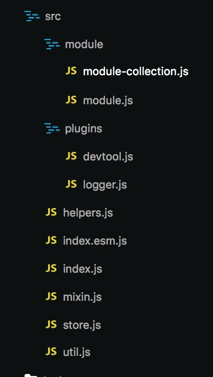

## Vuex源码阅读分析

Vuex是专为Vue开发的统一状态管理工具。当我们的项目不是很复杂时，一些交互可以通过全局事件总线解决，但是这种观察者模式有些弊端，开发时可能没什么感觉，但是当项目变得复杂，维护时往往会摸不着头脑，如果是后来加入的伙伴更会觉得很无奈。这时候可以采用Vuex方案，它可以使得我们的项目的数据流变得更加清晰。本文将会分析Vuex的整个实现思路，当是自己读完源码的一个总结。

### 目录结构



- module：提供对module的处理，主要是对state的处理，最后构建成一棵module tree

- plugins：和devtools配合的插件，提供像时空旅行这样的调试功能。

- helpers：提供如mapActions、mapMutations这样的api

- index、index.esm：源码的主入口，抛出Store和mapActions等api，一个用于commonjs的打包、一个用于es module的打包

- mixin：提供install方法，用于注入$store

- store：vuex的核心代码

- util：一些工具函数，如deepClone、isPromise、assert

### 源码分析

先从一个简单的示例入手，一步一步分析整个代码的执行过程，下面是官方提供的简单示例

```js
// store.js
import Vue from 'vue'
import Vuex from 'vuex'

Vue.use(Vuex)
```

Vue官方建议的插件使用方法是使用Vue.use方法，这个方法会调用插件的install方法，看看install方法都做了些什么，从index.js中可以看到install方法在store.js中抛出，部分代码如下

```js
let Vue // bind on install

export function install (_Vue) {
  if (Vue && _Vue === Vue) {
    if (process.env.NODE_ENV !== 'production') {
      console.error(
        '[vuex] already installed. Vue.use(Vuex) should be called only once.'
      )
    }
    return
  }
  Vue = _Vue
  applyMixin(Vue)
}
```

声明了一个Vue变量，这个变量在install方法中会被赋值，这样可以给当前作用域提供Vue，这样做的好处是不需要额外`import Vue from 'vue'` 不过我们也可以这样写，然后让打包工具不要将其打开，而是指向开发者所提供的Vue，比如webpack的`externals`，这里就不展开了。执行install会先判断Vue是否已经被赋值，避免二次安装。然后调用applyMixin方法，代码如下

```js
export default function (Vue) {
  const version = Number(Vue.version.split('.')[0])

  if (version >= 2) {
    Vue.mixin({ beforeCreate: vuexInit })
  } else {
    // override init and inject vuex init procedure
    // for 1.x backwards compatibility.
    const _init = Vue.prototype._init
    Vue.prototype._init = function (options = {}) {
      options.init = options.init
        ? [vuexInit].concat(options.init)
        : vuexInit
      _init.call(this, options)
    }
  }

  /**
   * Vuex init hook, injected into each instances init hooks list.
   */

  function vuexInit () {
    const options = this.$options
    // store injection
    // 当我们在执行new Vue的时候，需要提供store字段
    if (options.store) {
      // 如果是root，将store绑到this.$store
      this.$store = typeof options.store === 'function'
        ? options.store()
        : options.store
    } else if (options.parent && options.parent.$store) {
      // 否则拿parent上的$store
      // 从而实现所有组件共用一个store实例
      this.$store = options.parent.$store
    }
  }
}
```

这里会区分vue的版本，2.x和1.x的钩子是不一样的，如果是2.x使用beforeCreate，1.x即使用_init。当我们在执行new Vue启动一个Vue应用程序时，需要给上store字段，用于注入store

接下去继续看例子

```js
// store.js
export default new Vuex.Store({
  state: {
    count: 0
  },
  getters: {
    evenOrOdd: state => state.count % 2 === 0 ? 'even' : 'odd'
  },
  actions:  {
    increment: ({ commit }) => commit('increment'),
    decrement: ({ commit }) => commit('decrement')
  },
  mutations: {
    increment (state) {
      state.count++
    },
    decrement (state) {
      state.count--
    }
  }
})
```

```js
// app.js
new Vue({
  el: '#app',
  store, // 传入store，在beforeCreate钩子中会用到
  render: h => h(Counter)
})
```

这里是调用Store构造函数，传入一个对象，包括state、actions等等，接下去看看Store构造函数都做了些什么

```js
export class Store {
  constructor (options = {}) {
    if (!Vue && typeof window !== 'undefined' && window.Vue) {
      // 挂载在window上的自动安装，也就是通过script标签引入时不需要手动调用Vue.use(Vuex)
      install(window.Vue)
    }

    if (process.env.NODE_ENV !== 'production') {
      // 断言必须使用Vue.use(Vuex),在install方法中会给Vue赋值
      // 断言必须存在Promise
      // 断言必须使用new操作符
      assert(Vue, `must call Vue.use(Vuex) before creating a store instance.`)
      assert(typeof Promise !== 'undefined', `vuex requires a Promise polyfill in this browser.`)
      assert(this instanceof Store, `Store must be called with the new operator.`)
    }

    const {
      plugins = [],
      strict = false
    } = options

    // store internal state
    this._committing = false
    this._actions = Object.create(null)
    this._actionSubscribers = []
    this._mutations = Object.create(null)
    this._wrappedGetters = Object.create(null)
    // 这里进行module收集，只处理了state
    this._modules = new ModuleCollection(options)
    this._modulesNamespaceMap = Object.create(null)
    this._subscribers = []
    this._watcherVM = new Vue()

    // bind commit and dispatch to self
    const store = this
    const { dispatch, commit } = this
    this.dispatch = function boundDispatch (type, payload) {
      return dispatch.call(store, type, payload)
    }
    this.commit = function boundCommit (type, payload, options) {
      return commit.call(store, type, payload, options)
    }

    // strict mode
    this.strict = strict

    const state = this._modules.root.state

    console.log(this._modules)
    // debugger
    // init root module.
    // this also recursively registers all sub-modules
    // and collects all module getters inside this._wrappedGetters
    installModule(this, state, [], this._modules.root)

    console.log(this._modules)
    // initialize the store vm, which is responsible for the reactivity
    // (also registers _wrappedGetters as computed properties)
    resetStoreVM(this, state)

    // apply plugins
    plugins.forEach(plugin => plugin(this))

    if (Vue.config.devtools) {
      devtoolPlugin(this)
    }
  }
}
```

首先会判断Vue是不是挂载在window上，如果是的话，调用install方法，然后进行断言，必须先调用Vue.use(Vuex)。必须提供`Promise`，这里应该是为了让Vuex的体积更小，让开发者自行提供`Promise`的`polyfill`，一般我们可以使用`babel-runtime`或者`babel-polyfill`引入。最后断言必须使用new操作符调用Store函数。

接下去是一些内部变量的初始化，各种变量是用来做什么的后面会讲到，接下去的重点是

```js
this._modules = new ModuleCollection(options)
```

接下去看看ModuleCollection函数都做了什么，部分代码如下

```js
export default class ModuleCollection {
  constructor (rawRootModule) {
    // register root module (Vuex.Store options)
    this.register([], rawRootModule, false)
  }

  get (path) {
    return path.reduce((module, key) => {
      return module.getChild(key)
    }, this.root)
  }

  register (path, rawModule, runtime = true) {
    if (process.env.NODE_ENV !== 'production') {
      assertRawModule(path, rawModule)
    }

    const newModule = new Module(rawModule, runtime)
    if (path.length === 0) {
      this.root = newModule
    } else {
      const parent = this.get(path.slice(0, -1))
      parent.addChild(path[path.length - 1], newModule)
    }

    // register nested modules
    if (rawModule.modules) {
      forEachValue(rawModule.modules, (rawChildModule, key) => {
        this.register(path.concat(key), rawChildModule, runtime)
      })
    }
  }
}
```