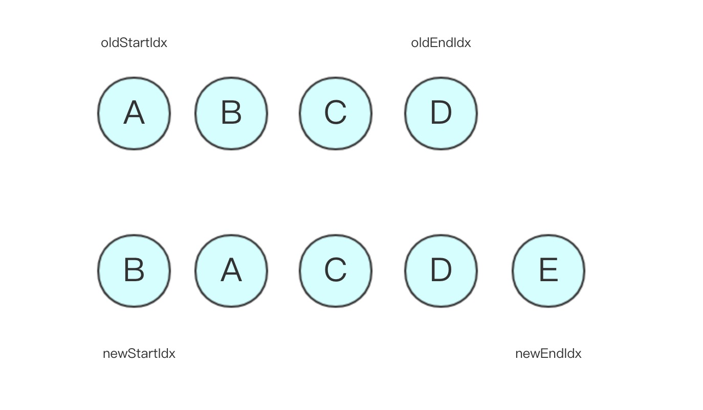
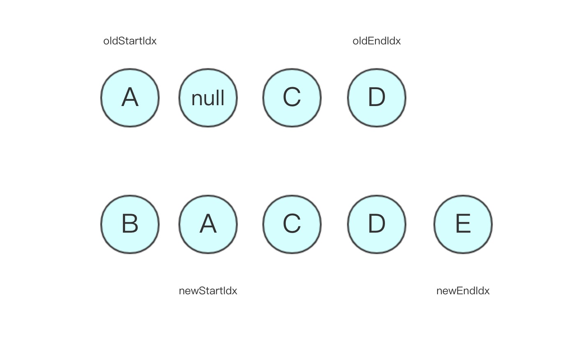
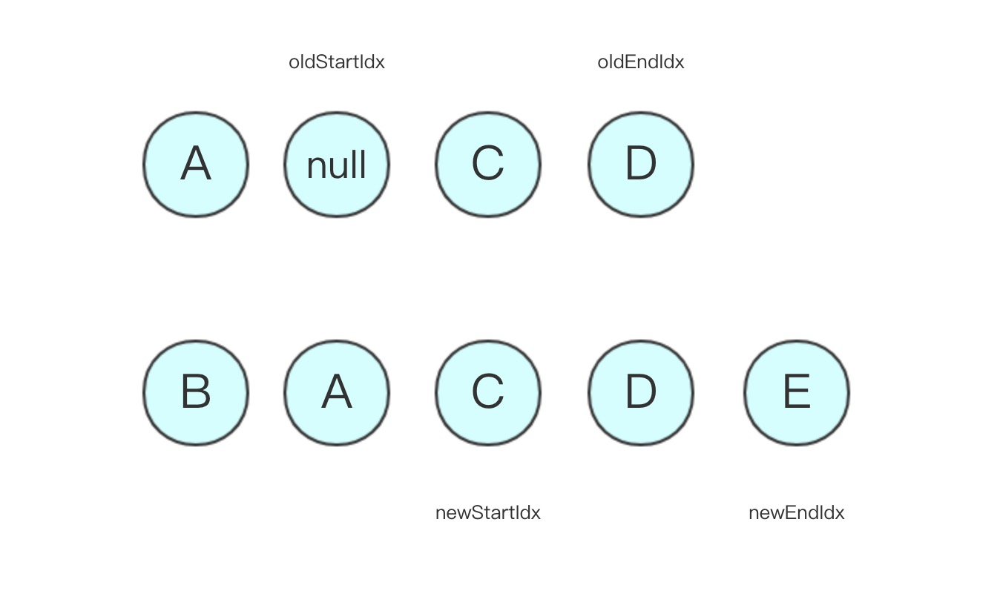
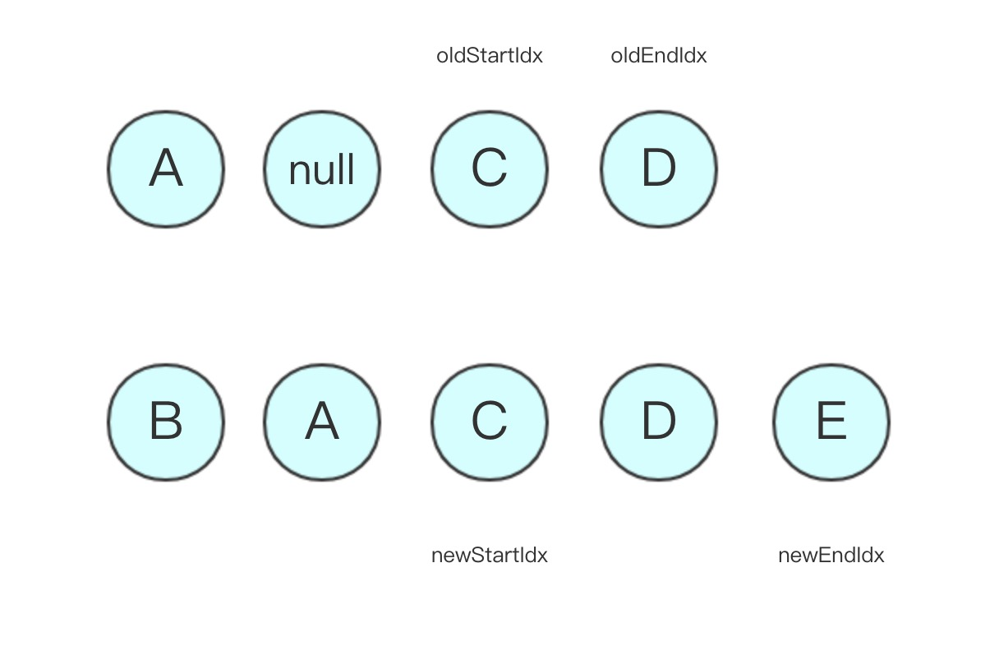
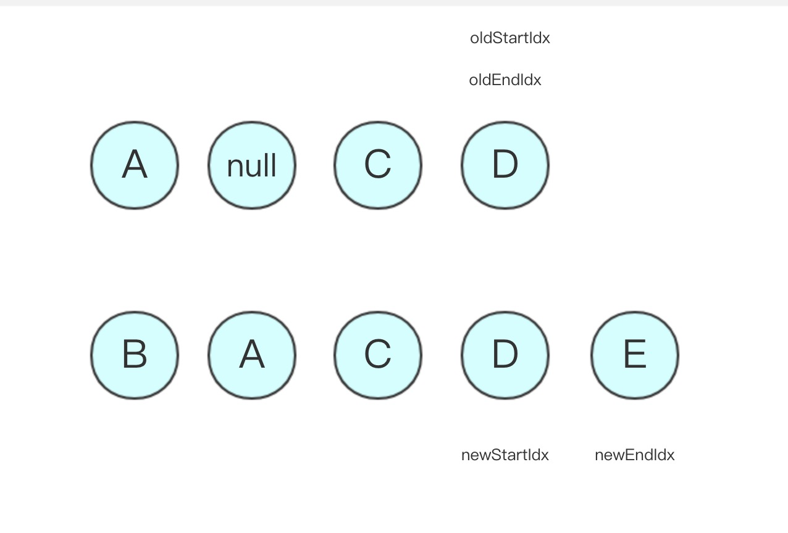
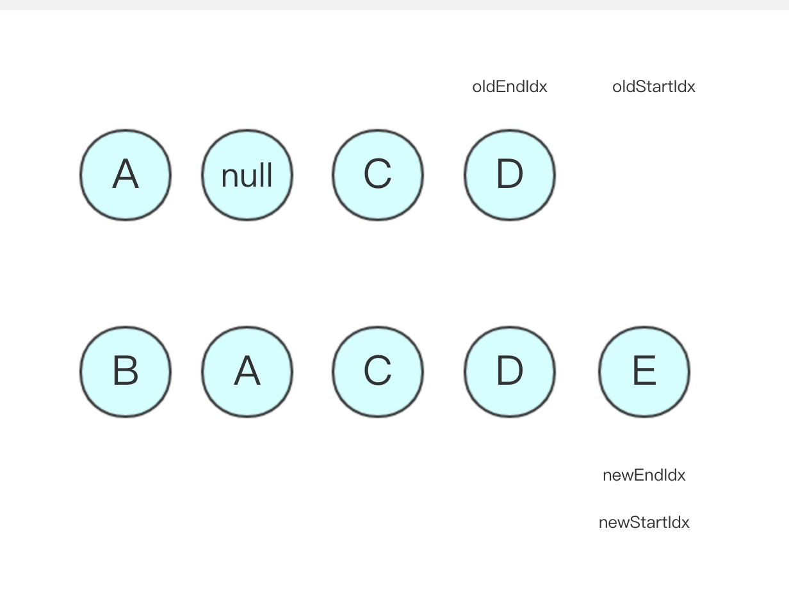

## snabbdom 源码阅读

随着React Vue等框架的流行，Virtual DOM也越来越火，snabbdom是其中一种实现，而且Vue 2.x版本的Virtual DOM部分也是基于snabbdom进行修改的。snabbdom这个库核心代码只有200多行，非常适合想要深入了解Virtual DOM实现的读者阅读。如果您没听说过snabbdom，可以先看看[官方文档](https://github.com/snabbdom/snabbdom)。

### 为什么选择snabbdom

> 核心代码只有200行，丰富的测试用例

> 强大的插件系统、hook系统

> vue使用了snabbdom，读懂snabbdom对理解vue的实现有帮助

### 什么是Virtual DOM

snabbdom是Virtual DOM的一种实现，所以在此之前，你需要先知道什么是Virtual DOM。通俗的说，Virtual DOM就是一个js对象，它是真实DOM的抽象，只保留一些有用的信息，更轻量地描述DOM树的结构。 比如在`snabbdom`中，是这样来定义一个`VNode`的

```js
export interface VNode {
  sel: string | undefined;
  data: VNodeData | undefined;
  children: Array<VNode | string> | undefined;
  elm: Node | undefined;
  text: string | undefined;
  key: Key | undefined;
}

export interface VNodeData {
  props?: Props;
  attrs?: Attrs;
  class?: Classes;
  style?: VNodeStyle;
  dataset?: Dataset;
  on?: On;
  hero?: Hero;
  attachData?: AttachData;
  hook?: Hooks;
  key?: Key;
  ns?: string; // for SVGs
  fn?: () => VNode; // for thunks
  args?: Array<any>; // for thunks
  [key: string]: any; // for any other 3rd party module
}
```

从上面的定义我们可以看到，我们可以用js对象来描述`dom`结构，那我们是不是可以对两个状态下的js对象进行对比，记录出它们的差异，然后把它应用到真正的dom树上呢？答案是可以的，这便是`diff`算法，算法的基本步骤如下：

- 用js对象来描述dom树结构，然后用这个js对象来创建一棵真正的dom树，插入到文档中
- 当状态更新时，将新的js对象和旧的js对象进行比较，得到两个对象之间的差异
- 将差异应用到真正的dom上

接下来我们来分析这整个过程的实现

### 源码分析

首先从一个简单的例子入手，一步一步分析整个代码的执行过程，下面是官方的一个简单示例：

```js
var snabbdom = require('snabbdom');
var patch = snabbdom.init([ // Init patch function with chosen modules
  require('snabbdom/modules/class').default, // makes it easy to toggle classes
  require('snabbdom/modules/props').default, // for setting properties on DOM elements
  require('snabbdom/modules/style').default, // handles styling on elements with support for animations
  require('snabbdom/modules/eventlisteners').default, // attaches event listeners
]);
var h = require('snabbdom/h').default; // helper function for creating vnodes

var container = document.getElementById('container');

var vnode = h('div#container.two.classes', {on: {click: someFn}}, [
  h('span', {style: {fontWeight: 'bold'}}, 'This is bold'),
  ' and this is just normal text',
  h('a', {props: {href: '/foo'}}, 'I\'ll take you places!')
]);
// Patch into empty DOM element – this modifies the DOM as a side effect
patch(container, vnode);

var newVnode = h('div#container.two.classes', {on: {click: anotherEventHandler}}, [
  h('span', {style: {fontWeight: 'normal', fontStyle: 'italic'}}, 'This is now italic type'),
  ' and this is still just normal text',
  h('a', {props: {href: '/bar'}}, 'I\'ll take you places!')
]);
// Second `patch` invocation
patch(vnode, newVnode); // Snabbdom efficiently updates the old view to the new state
```

首先`snabbdom`模块提供一个`init`方法，它接收一个数组，数组中是各种`module`，这样的设计使得这个库更具扩展性，我们也可以实现自己的`module`，而且可以根据自己的需要引入相应的`module`，比如如果不需要写入`class`，那你可以直接把`class`的模块移除。
调用`init`方法会返回一个`patch`函数，这个函数接受两个参数，第一个是旧的`vnode`节点或是`dom`节点，第二个参数是新的`vnode`节点，调用`patch`函数会对dom进行更新。`vnode`可以通过使用`h`函数来生成。使用起来相当简单，这也是本文接下来要分析的内容。

#### init 函数

```typescript
export interface Module {
  pre: PreHook;
  create: CreateHook;
  update: UpdateHook;
  destroy: DestroyHook;
  remove: RemoveHook;
  post: PostHook;
}

export function init(modules: Array<Partial<Module>>, domApi?: DOMAPI) {
  // cbs 用于收集module中的hook
  let i: number, j: number, cbs = ({} as ModuleHooks);

  const api: DOMAPI = domApi !== undefined ? domApi : htmlDomApi;

  // 收集module中的hook
  for (i = 0; i < hooks.length; ++i) {
    cbs[hooks[i]] = [];
    for (j = 0; j < modules.length; ++j) {
      const hook = modules[j][hooks[i]];
      if (hook !== undefined) {
        (cbs[hooks[i]] as Array<any>).push(hook);
      }
    }
  }

  function emptyNodeAt(elm: Element) {
    // ...
  }

  function createRmCb(childElm: Node, listeners: number) {
    // ...
  }

  // 创建真正的dom节点
  function createElm(vnode: VNode, insertedVnodeQueue: VNodeQueue): Node {
    // ...
  }

  function addVnodes(parentElm: Node, before: Node | null, vnodes: Array<VNode>, startIdx: number, endIdx: number, insertedVnodeQueue: VNodeQueue) {
    // ...
  }

  // 调用destory hook 先调用用户的 再调用内置的
  // 如果存在children 递归调用
  function invokeDestroyHook(vnode: VNode) {
    // ...
  }

  function removeVnodes(parentElm: Node, vnodes: Array<VNode>, startIdx: number, endIdx: number): void {
    // ...
  }

  function updateChildren(parentElm: Node, oldCh: Array<VNode>, newCh: Array<VNode>, insertedVnodeQueue: VNodeQueue) {
    // ...
  }

  function patchVnode(oldVnode: VNode, vnode: VNode, insertedVnodeQueue: VNodeQueue) {
    // ...
  }

  return function patch(oldVnode: VNode | Element, vnode: VNode): VNode {
    // ...
  };
}
```

上面是`init`方法的一些源码，为了阅读方便，暂时先把一些方法的具体实现给注释掉，等有用到的时候再具体分析。
通过参数可以知道，这里有接受一个`modules`数组，另外有一个可选的参数`domApi`，如果没传递会使用浏览器中和dom相关的api，具体可以看[这里](https://github.com/snabbdom/snabbdom/blob/master/src/htmldomapi.ts)，这样的设计也很有好处，它可以让用户自定义平台相关的api，比如可以看看[weex的相关实现](https://github.com/vuejs/vue/blob/dev/src/platforms/weex/runtime/node-ops.js)
首先这里会对`module`中的`hook`进行收集，保存到`cbs`中。然后定义了各种函数，这里可以先不管，接着就是返回一个`patch`函数了，这里也先不分析它的具体逻辑。这样`init`就结束了。

#### h 函数

根据例子的流程，接下来看看`h`方法的实现

```typescript
export function h(sel: string): VNode;
export function h(sel: string, data: VNodeData): VNode;
export function h(sel: string, children: VNodeChildren): VNode;
export function h(sel: string, data: VNodeData, children: VNodeChildren): VNode;
export function h(sel: any, b?: any, c?: any): VNode {
  var data: VNodeData = {}, children: any, text: any, i: number;
  // 参数格式化
  if (c !== undefined) {
    data = b;
    if (is.array(c)) { children = c; }
    else if (is.primitive(c)) { text = c; }
    else if (c && c.sel) { children = [c]; }
  } else if (b !== undefined) {
    if (is.array(b)) { children = b; }
    else if (is.primitive(b)) { text = b; }
    else if (b && b.sel) { children = [b]; }
    else { data = b; }
  }
  // 如果存在children，将不是vnode的项转成vnode
  if (children !== undefined) {
    for (i = 0; i < children.length; ++i) {
      if (is.primitive(children[i])) children[i] = vnode(undefined, undefined, undefined, children[i], undefined);
    }
  }
  // svg元素添加namespace
  if (
    sel[0] === 's' && sel[1] === 'v' && sel[2] === 'g' &&
    (sel.length === 3 || sel[3] === '.' || sel[3] === '#')
  ) {
    addNS(data, children, sel);
  }
  // 返回vnode
  return vnode(sel, data, children, text, undefined);
};

function addNS(data: any, children: VNodes | undefined, sel: string | undefined): void {
  data.ns = 'http://www.w3.org/2000/svg';
  if (sel !== 'foreignObject' && children !== undefined) {
    for (let i = 0; i < children.length; ++i) {
      let childData = children[i].data;
      if (childData !== undefined) {
        addNS(childData, (children[i] as VNode).children as VNodes, children[i].sel);
      }
    }
  }
}

export function vnode(sel: string | undefined,
                      data: any | undefined,
                      children: Array<VNode | string> | undefined,
                      text: string | undefined,
                      elm: Element | Text | undefined): VNode {
  let key = data === undefined ? undefined : data.key;
  return {sel: sel, data: data, children: children,
          text: text, elm: elm, key: key};
}

```

因为`h`函数后两个参数是可选的，而且有各种传递方式，所以这里首先会对参数进行格式化，然后对`children`属性做处理，将可能不是`vnode`的项转成`vnode`，如果是`svg`元素，会做一个特殊处理，最后返回一个`vnode`对象

#### patch 函数

`patch`函数是`snabbdom`的核心，调用`init`会返回这个函数，用来做`dom`相关的更新，接下来看看它的具体实现

```typescript
function patch(oldVnode: VNode | Element, vnode: VNode): VNode {
  let i: number, elm: Node, parent: Node;
  const insertedVnodeQueue: VNodeQueue = [];
  // 调用module中的pre hook
  for (i = 0; i < cbs.pre.length; ++i) cbs.pre[i]();

  // 如果传入的是Element 转成空的vnode
  if (!isVnode(oldVnode)) {
    oldVnode = emptyNodeAt(oldVnode);
  }

  // sameVnode时(sel和key相同) 调用patchVnode
  if (sameVnode(oldVnode, vnode)) {
    patchVnode(oldVnode, vnode, insertedVnodeQueue);
  } else {
    elm = oldVnode.elm as Node;
    parent = api.parentNode(elm);

    // 创建新的dom节点 vnode.elm
    createElm(vnode, insertedVnodeQueue);

    if (parent !== null) {
      // 插入dom
      api.insertBefore(parent, vnode.elm as Node, api.nextSibling(elm));
      // 移除旧dom
      removeVnodes(parent, [oldVnode], 0, 0);
    }
  }

  // 调用元素上的insert hook，注意insert hook在module上不支持
  for (i = 0; i < insertedVnodeQueue.length; ++i) {
    (((insertedVnodeQueue[i].data as VNodeData).hook as Hooks).insert as any)(insertedVnodeQueue[i]);
  }

  // 调用module post hook
  for (i = 0; i < cbs.post.length; ++i) cbs.post[i]();
  return vnode;
};

function emptyNodeAt(elm: Element) {
  const id = elm.id ? '#' + elm.id : '';
  const c = elm.className ? '.' + elm.className.split(' ').join('.') : '';
  return vnode(api.tagName(elm).toLowerCase() + id + c, {}, [], undefined, elm);
}

// key和selector相同
function sameVnode(vnode1: VNode, vnode2: VNode): boolean {
  return vnode1.key === vnode2.key && vnode1.sel === vnode2.sel;
}
```

首先会调用内置的`pre hook`，你可能会有疑惑，为什么没有调用来自各个元素的`pre hook`，这是因为元素上不支持`pre hook`，也有一些`hook`不支持在`module`中，具体可以查看[这里的文档](https://github.com/snabbdom/snabbdom#overview)。然后会判断传入的第一个参数是否为`vnode`类型，如果不是，会调用`emptyNodeAt`然后将其转换成一个`vnode`，`emptyNodeAt`的具体实现也很简单，注意这里只是保留了`class`和`style`，这个和`toVnode`的实现有些区别，因为这里并不需要保存很多信息，比如`prop``attribute`等。接着调用`sameVnode`来判断是否为相同的`vnode`节点，具体实现也很简单，这里只是判断了`key`和`sel`是否相同。如果相同，调用`patchVnode`，如果不相同，会调用`createElm`来创建一个新的`dom`节点，然后如果存在父节点，便将其插入到dom上，然后移除旧的`dom`节点来完成更新。最后调用元素上的`insert hook` 和 `module`上的`post hook`。
这里的重点是`patchVnode`和`createElm`函数，我们先看`createElm`函数，看看是如何来创建`dom`节点的

#### createElm 函数

```js
// 创建真正的dom节点
function createElm(vnode: VNode, insertedVnodeQueue: VNodeQueue): Node {
  let i: any, data = vnode.data;

  // 调用元素的init hook
  if (data !== undefined) {
    if (isDef(i = data.hook) && isDef(i = i.init)) {
      i(vnode);
      data = vnode.data;
    }
  }
  let children = vnode.children, sel = vnode.sel;
  // 注释节点
  if (sel === '!') {
    if (isUndef(vnode.text)) {
      vnode.text = '';
    }
    // 创建注释节点
    vnode.elm = api.createComment(vnode.text as string);
  } else if (sel !== undefined) {
    // Parse selector
    const hashIdx = sel.indexOf('#');
    const dotIdx = sel.indexOf('.', hashIdx);
    const hash = hashIdx > 0 ? hashIdx : sel.length;
    const dot = dotIdx > 0 ? dotIdx : sel.length;
    const tag = hashIdx !== -1 || dotIdx !== -1 ? sel.slice(0, Math.min(hash, dot)) : sel;
    const elm = vnode.elm = isDef(data) && isDef(i = (data as VNodeData).ns) ? api.createElementNS(i, tag)
                                                                             : api.createElement(tag);
    if (hash < dot) elm.setAttribute('id', sel.slice(hash + 1, dot));
    if (dotIdx > 0) elm.setAttribute('class', sel.slice(dot + 1).replace(/\./g, ' '));

    // 先调用内置的hook
    for (i = 0; i < cbs.create.length; ++i) cbs.create[i](emptyNode, vnode);

    // 挂载子节点
    if (is.array(children)) {
      for (i = 0; i < children.length; ++i) {
        const ch = children[i];
        if (ch != null) {
          api.appendChild(elm, createElm(ch as VNode, insertedVnodeQueue));
        }
      }
    } else if (is.primitive(vnode.text)) {
      api.appendChild(elm, api.createTextNode(vnode.text));
    }
    i = (vnode.data as VNodeData).hook; // Reuse variable
    // 调用元素上的hook
    if (isDef(i)) {
      // 调用create hook
      if (i.create) i.create(emptyNode, vnode);
      // insert hook存储起来 等dom插入后才会调用，这里用个数组来保存能避免调用时再次对vnode树做遍历
      if (i.insert) insertedVnodeQueue.push(vnode);
    }
  } else {
    // 文本节点
    vnode.elm = api.createTextNode(vnode.text as string);
  }
  return vnode.elm;
}
```

这里的逻辑也很清晰，首先会调用元素的`init hook`，接着这里会存在三种情况：
- 如果当前元素是注释节点，会调用`createComment`来创建一个注释节点，然后挂载到`vnode.elm`，

- 如果不存在选择器，只是单纯的文本，调用`createTextNode`来创建文本，然后挂载到`vnode.elm`，

- 如果存在选择器，会对这个选择器做解析，得到`tag`、`id`和`class`，然后调用`createElement`或`createElementNS`来生成节点，并挂载到`vnode.elm`。接着调用`module`上的`create hook`，如果存在`children`，遍历所有子节点并递归调用`createElm`创建`dom`，通过`appendChild`挂载到当前的`elm`上，不存在`children`但存在`text`，便使用`createTextNode`来创建文本。最后调用调用元素上的`create hook`和保存存在`insert hook`的`vnode`，因为`insert hook`需要等`dom`真正挂载到`document`上才会调用，这里用个数组来保存可以避免真正需要调用时需要对`vnode`树做遍历。

接着我们来看看`snabbdom`是如何做`vnode`的`diff`的，这部分是`Virtual DOM`的核心。

#### patchVnode 函数

这个函数做的事情是对传入的两个`vnode`做`diff`，如果存在更新，将其反馈到`dom`上

```typescript
function patchVnode(oldVnode: VNode, vnode: VNode, insertedVnodeQueue: VNodeQueue) {
  let i: any, hook: any;
  // 调用 prepatch hook
  if (isDef(i = vnode.data) && isDef(hook = i.hook) && isDef(i = hook.prepatch)) {
    i(oldVnode, vnode);
  }
  const elm = vnode.elm = (oldVnode.elm as Node);
  let oldCh = oldVnode.children;
  let ch = vnode.children;
  if (oldVnode === vnode) return;
  if (vnode.data !== undefined) {
    // 调用module上的 update hook
    for (i = 0; i < cbs.update.length; ++i) cbs.update[i](oldVnode, vnode);
    i = vnode.data.hook;
    // 调用vnode上的update hook
    if (isDef(i) && isDef(i = i.update)) i(oldVnode, vnode);
  }
  if (isUndef(vnode.text)) {
    if (isDef(oldCh) && isDef(ch)) {
      // 新旧节点均存在children，且不一样时，对children进行diff
      // thunk中会做相关优化和这个相关
      if (oldCh !== ch) updateChildren(elm, oldCh as Array<VNode>, ch as Array<VNode>, insertedVnodeQueue);
    } else if (isDef(ch)) {
      // 旧节点不存在children 新节点有children
      // 旧节点存在text 置空
      if (isDef(oldVnode.text)) api.setTextContent(elm, '');
      // 加入新的vnode
      addVnodes(elm, null, ch as Array<VNode>, 0, (ch as Array<VNode>).length - 1, insertedVnodeQueue);
    } else if (isDef(oldCh)) {
      // 新节点不存在children 旧节点存在children 移除旧节点的children
      removeVnodes(elm, oldCh as Array<VNode>, 0, (oldCh as Array<VNode>).length - 1);
    } else if (isDef(oldVnode.text)) {
      // 旧节点存在text 置空
      api.setTextContent(elm, '');
    }
  } else if (oldVnode.text !== vnode.text) {
    // 更新text
    api.setTextContent(elm, vnode.text as string);
  }
  // 调用 postpatch hook
  if (isDef(hook) && isDef(i = hook.postpatch)) {
    i(oldVnode, vnode);
  }
}
```

首先调用`vnode`上的`prepatch hook`，如果当前的两个`vnode`完全相同，直接返回。接着调用`module`和`vnode`上的`update hook`。然后会分为以下几种情况做处理：

- 均存在`children`且不相同，调用`updateChildren`
- 新`vnode`存在`children`，旧`vnode`不存在`children`，如果旧`vnode`存在`text`先清空，然后调用`addVnodes`
- 新`vnode`不存在`children`，旧`vnode`存在`children`，调用`removeVnodes`移除`children`
- 均不存在`children`，新`vnode`不存在`text`，移除旧`vnode`的`text`
- 均存在`text`，更新`text`

最后调用`postpatch hook`。整个过程很清晰，我们需要关注的是`updateChildren``addVnodes``removeVnodes`。

#### updateChildren

```typescript
function updateChildren(parentElm: Node, oldCh: Array<VNode>, newCh: Array<VNode>, insertedVnodeQueue: VNodeQueue) {
  let oldStartIdx = 0, newStartIdx = 0;
  let oldEndIdx = oldCh.length - 1;
  let oldStartVnode = oldCh[0];
  let oldEndVnode = oldCh[oldEndIdx];
  let newEndIdx = newCh.length - 1;
  let newStartVnode = newCh[0];
  let newEndVnode = newCh[newEndIdx];
  let oldKeyToIdx: any;
  let idxInOld: number;
  let elmToMove: VNode;
  let before: any;

  // 遍历oldCh newCh，对节点进行比较和更新
  while (oldStartIdx <= oldEndIdx && newStartIdx <= newEndIdx) {
    // 如果进行比较的4个节点中存在空节点，为空的节点下标向中间推进，继续下个循环
    if (oldStartVnode == null) {
      oldStartVnode = oldCh[++oldStartIdx]; // Vnode might have been moved left
    } else if (oldEndVnode == null) {
      oldEndVnode = oldCh[--oldEndIdx];
    } else if (newStartVnode == null) {
      newStartVnode = newCh[++newStartIdx];
    } else if (newEndVnode == null) {
      newEndVnode = newCh[--newEndIdx];
      // 新旧开始节点相同，直接调用patchVnode进行更新，下标向中间推进
    } else if (sameVnode(oldStartVnode, newStartVnode)) {
      patchVnode(oldStartVnode, newStartVnode, insertedVnodeQueue);
      oldStartVnode = oldCh[++oldStartIdx];
      newStartVnode = newCh[++newStartIdx];
      // 新旧结束节点相同，逻辑同上
    } else if (sameVnode(oldEndVnode, newEndVnode)) {
      patchVnode(oldEndVnode, newEndVnode, insertedVnodeQueue);
      oldEndVnode = oldCh[--oldEndIdx];
      newEndVnode = newCh[--newEndIdx];
      // 旧开始节点等于新的节点节点，说明节点向右移动了，调用patchVnode进行更新
    } else if (sameVnode(oldStartVnode, newEndVnode)) { // Vnode moved right
      patchVnode(oldStartVnode, newEndVnode, insertedVnodeQueue);
      // 旧开始节点等于新的结束节点，说明节点向右移动了
      // 具体移动到哪，因为新节点处于末尾，所以添加到旧结束节点（会随着updateChildren左移）的后面
      // 注意这里需要移动dom，因为节点右移了，而为什么是插入oldEndVnode的后面呢？
      // 可以分为两个情况来理解：
      // 1. 当循环刚开始，下标都还没有移动，那移动到oldEndVnode的后面就相当于是最后面，是合理的
      // 2. 循环已经执行过一部分了，因为每次比较结束后，下标都会向中间靠拢，而且每次都会处理一个节点，这时下标左右两边已经处理完成，可以把下标开始到结束区域当成是并未开始循环的一个整体，所以插入到oldEndVnode后面是合理的（在当前循环来说，也相当于是最后面，同1）
      api.insertBefore(parentElm, oldStartVnode.elm as Node, api.nextSibling(oldEndVnode.elm as Node));
      oldStartVnode = oldCh[++oldStartIdx];
      newEndVnode = newCh[--newEndIdx];
      // 旧的结束节点等于新的开始节点，说明节点是向左移动了，逻辑同上
    } else if (sameVnode(oldEndVnode, newStartVnode)) { // Vnode moved left
      patchVnode(oldEndVnode, newStartVnode, insertedVnodeQueue);
      api.insertBefore(parentElm, oldEndVnode.elm as Node, oldStartVnode.elm as Node);
      oldEndVnode = oldCh[--oldEndIdx];
      newStartVnode = newCh[++newStartIdx];
      // 如果以上4种情况都不匹配，可能存在下面2种情况
      // 1. 这个节点是新创建的
      // 2. 这个节点在原来的位置是处于中间的（oldStartIdx和endStartIdx之间）
    } else {
      // 如果oldKeyToIdx不存在，创建 key 到 index 的映射
      // 而且也存在各种细微的优化，只会创建一次，并且已经完成的部分不需要映射
      if (oldKeyToIdx === undefined) {
        oldKeyToIdx = createKeyToOldIdx(oldCh, oldStartIdx, oldEndIdx);
      }
      // 拿到在oldCh下对应的下标
      idxInOld = oldKeyToIdx[newStartVnode.key as string];
      // 如果下标不存在，说明这个节点是新创建的
      if (isUndef(idxInOld)) { // New element
        // 插入到oldStartVnode的前面（对于当前循环来说，相当于最前面）
        api.insertBefore(parentElm, createElm(newStartVnode, insertedVnodeQueue), oldStartVnode.elm as Node);
        newStartVnode = newCh[++newStartIdx];
      } else {
        // 如果是已经存在的节点 找到需要移动位置的节点
        elmToMove = oldCh[idxInOld];
        // 虽然key相同了，但是seletor不相同，需要调用createElm来创建新的dom节点
        if (elmToMove.sel !== newStartVnode.sel) {
          api.insertBefore(parentElm, createElm(newStartVnode, insertedVnodeQueue), oldStartVnode.elm as Node);
        } else {
          // 否则调用patchVnode对旧vnode做更新
          patchVnode(elmToMove, newStartVnode, insertedVnodeQueue);
          // 在oldCh中将当前已经处理处理的的vnode置空，等循环到这个下标的时候直接跳过
          oldCh[idxInOld] = undefined as any;
          // 插入到oldStartVnode的前面（对于当前循环来说，相当于最前面）
          api.insertBefore(parentElm, (elmToMove.elm as Node), oldStartVnode.elm as Node);
        }
        newStartVnode = newCh[++newStartIdx];
      }
    }
  }
  // 循环结束后，可能会存在两种情况
  // 1. oldCh已经全部处理完成，而newCh还有新的节点，需要对剩下的每个项都创建新的dom
  if (oldStartIdx <= oldEndIdx || newStartIdx <= newEndIdx) {
    if (oldStartIdx > oldEndIdx) {
      before = newCh[newEndIdx+1] == null ? null : newCh[newEndIdx+1].elm;
      addVnodes(parentElm, before, newCh, newStartIdx, newEndIdx, insertedVnodeQueue);
      // 2. newCh已经全部处理完成，而oldCh还有旧的节点，需要将多余的节点移除
    } else {
      removeVnodes(parentElm, oldCh, oldStartIdx, oldEndIdx);
    }
  }
}
```

整个过程简单来说，对两个数组进行对比，找到相同的部分进行复用，并更新。整个逻辑可能看起来有点懵，可以结合下面这个例子理解下:

1. 假设旧节点顺序为[A, B, C, D]，新节点为[B, A, C, D, E]



2. 第一轮比较：开始结束节点两两并不相等，于是看newStartVnode在旧节点中是否存在，最后找到了在第二个位置，调用patchVnode进行更新，将oldCh[1] 至空，将dom插入到oldStartVnode前面，newStartIdx向中间移动，状态更新如下



3. 第二轮比较：oldStartVnode 和 newStartVnode 相等，直接patchVnode，newStartIdx和oldStartIdx向中间移动，状态更新如下



4. 第三轮比较：oldStartVnode为空，oldStartIdx向中间移动，进入下轮比较，状态更新如下



5. 第四轮比较：oldStartVnode 和 newStartVnode 相等，直接patchVnode，newStartIdx和oldStartIdx向中间移动，状态更新如下



6. oldStartVnode 和 newStartVnode 相等，直接patchVnode，newStartIdx和oldStartIdx向中间移动，状态更新如下



7. 循环结束，由于是旧节点先结束循环而且还有没处理的新节点，处理剩下的新节点

#### addVnodes 和 removeVnodes 函数

```js
function addVnodes(parentElm: Node, before: Node | null, vnodes: Array<VNode>, startIdx: number, endIdx: number, insertedVnodeQueue: VNodeQueue) {
  for (; startIdx <= endIdx; ++startIdx) {
    const ch = vnodes[startIdx];
    if (ch != null) {
      api.insertBefore(parentElm, createElm(ch, insertedVnodeQueue), before);
    }
  }
}

function removeVnodes(parentElm: Node, vnodes: Array<VNode>, startIdx: number, endIdx: number): void {
  for (; startIdx <= endIdx; ++startIdx) {
    let i: any, listeners: number, rm: () => void, ch = vnodes[startIdx];
    if (ch != null) {
      if (isDef(ch.sel)) {
        // 调用destory hook
        invokeDestroyHook(ch);
        // 计算需要调用removecallback的次数 只有全部调用了才会移除dom
        listeners = cbs.remove.length + 1;
        rm = createRmCb(ch.elm as Node, listeners);
        // 调用module中是remove hook
        for (i = 0; i < cbs.remove.length; ++i) cbs.remove[i](ch, rm);
        // 调用用户的remve hook
        if (isDef(i = ch.data) && isDef(i = i.hook) && isDef(i = i.remove)) {
          i(ch, rm);
        } else {
          rm();
        }
      } else { // Text node
        api.removeChild(parentElm, ch.elm as Node);
      }
    }
  }
}

// 调用destory hook 先调用用户的 再调用内置的
// 如果存在children 递归调用
function invokeDestroyHook(vnode: VNode) {
  let i: any, j: number, data = vnode.data;
  if (data !== undefined) {
    if (isDef(i = data.hook) && isDef(i = i.destroy)) i(vnode);
    for (i = 0; i < cbs.destroy.length; ++i) cbs.destroy[i](vnode);
    if (vnode.children !== undefined) {
      for (j = 0; j < vnode.children.length; ++j) {
        i = vnode.children[j];
        if (i != null && typeof i !== "string") {
          invokeDestroyHook(i);
        }
      }
    }
  }
}

// 只有当所有的remove hook都调用了remove callback才会移除dom
function createRmCb(childElm: Node, listeners: number) {
  return function rmCb() {
    if (--listeners === 0) {
      const parent = api.parentNode(childElm);
      api.removeChild(parent, childElm);
    }
  };
}
```

这两个函数主要用来添加vnode和移除vnode，代码逻辑基本都能看懂。

#### thunk 函数

一般我们的应用是根据js状态来更新的，比如下面这个例子

```js
function renderNumber (num) {
  return h('span', num)
}
```
这里意味着如果`num`没有改变的话，那对`vnode`进行`patch`就是没有意义的，
对于这种情况，`snabbdom`提供了一种优化手段，也就是`thunk`，该函数同样返回一个`vnode`节点，但是在`patch`开始之前，会对参数进行一次比较，如果相同，将不会进行`patch`，这个有点类似于`React`的`pureComponent`，`pureComponent`的实现上会做一次浅比较`shadowEqual`，结合`immutable`数据进行使用。上面的例子可以变成这样

```js
function renderNumber (num) {
  return h('span', num)
}

// 如果num不发生变化 renderNumber将不会运行
function render(num) {
  return thunk('div', renderNumber, [num]);
}
```

它的具体实现如下：

```js
export interface ThunkFn {
  (sel: string, fn: Function, args: Array<any>): Thunk;
  (sel: string, key: any, fn: Function, args: Array<any>): Thunk;
}

// 使用h函数返回vnode，为其添加init和prepatch钩子
export const thunk = function thunk(sel: string, key?: any, fn?: any, args?: any): VNode {
  if (args === undefined) {
    args = fn;
    fn = key;
    key = undefined;
  }
  return h(sel, {
    key: key,
    hook: {init: init, prepatch: prepatch},
    fn: fn,
    args: args
  });
} as ThunkFn;

// 将vnode上的数据拷贝到thunk上 在patchVnode中会进行判断，如果相同会结束patchVnode
// 并将thunk的fn和args属性保存到vnode上 在prepatch时需要进行比较
function copyToThunk(vnode: VNode, thunk: VNode): void {
  thunk.elm = vnode.elm;
  (vnode.data as VNodeData).fn = (thunk.data as VNodeData).fn;
  (vnode.data as VNodeData).args = (thunk.data as VNodeData).args;
  thunk.data = vnode.data;
  thunk.children = vnode.children;
  thunk.text = vnode.text;
  thunk.elm = vnode.elm;
}

function init(thunk: VNode): void {
  const cur = thunk.data as VNodeData;
  const vnode = (cur.fn as any).apply(undefined, cur.args);
  copyToThunk(vnode, thunk);
}

function prepatch(oldVnode: VNode, thunk: VNode): void {
  let i: number, old = oldVnode.data as VNodeData, cur = thunk.data as VNodeData;
  const oldArgs = old.args, args = cur.args;
  if (old.fn !== cur.fn || (oldArgs as any).length !== (args as any).length) {
    // 如果fn不同或args长度不同，说明发生了变化，调用fn生成新的vnode并返回
    copyToThunk((cur.fn as any).apply(undefined, args), thunk);
    return;
  }
  for (i = 0; i < (args as any).length; ++i) {
    if ((oldArgs as any)[i] !== (args as any)[i]) {
      // 如果每个参数发生变化，逻辑同上
      copyToThunk((cur.fn as any).apply(undefined, args), thunk);
      return;
    }
  }
  copyToThunk(oldVnode, thunk);
}
```

可以回顾下patchVnode的实现，在prepatch后，会对vnode的数据做比较，比如当`children`相同、`text`相同都会结束`patchVnode`。

### 结语

到这里`snabbdom`的核心源码已经阅读完毕，剩下的还有一些内置的`module`，有兴趣的可以自行阅读。
